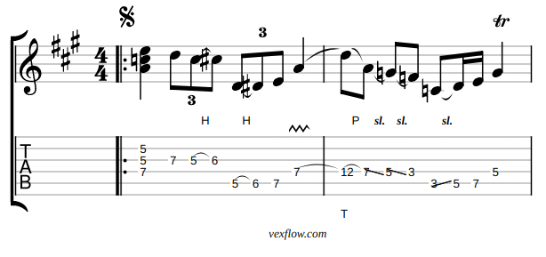

> 📣 This is a plugin for the [Joplin](https://joplinapp.org/) note-taking app.

# VexTab Plugin for Joplin

A Joplin plugin for rendering guitar tablature using the VexTab API 🎼🎸

> What is VexTab?
> 
> VexTab is a language that allows you to easily create, edit, and share standard notation and guitar tablature. Unlike ASCII tab, which is designed for readability, VexTab is designed for writeability.
>
> [Source](http://vexflow.com/vextab/tutorial.html)

## How to use

1. Follow these [instructions](https://joplinapp.org/plugins/) and install the plugin
2. Create a new note, or edit an existing note
3. Create a fenced block with the **codetype** `joplin-plugin-vextab`

### Example

    ```joplin-plugin-vextab
      tabstave notation=true key=A time=4/4
    
      notes :q =|: (5/2.5/3.7/4) :8 7-5h6/3 ^3^ 5h6-7/5 ^3^ :q 7V/4 |
      notes :8 t12p7/4 s5s3/4 :8 3s:16:5-7/5 :q p5/4
      text :w, |#segno, ,|, :hd, , #tr
    ```

This will render the image below;



## VexTab

- [VexTab Tutorial](http://vexflow.com/vextab/tutorial.html)
- [VexFlow Google Group](https://groups.google.com/g/vexflow)

## Development

This plugin comes packaged with a distribution copy of [VexTab 3.0.6](https://github.com/0xfe/vextab)

See the following [GitHub issue](https://github.com/0xfe/vextab/issues/106)

### Building the plugin

`npm run dist`

### Updating the plugin framework

To update the plugin framework, run;

`npm run update`
